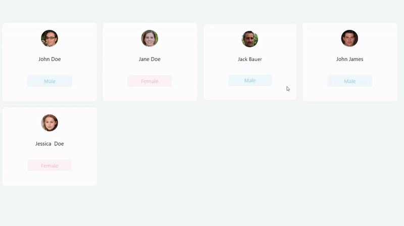

# What is Power Apps Gallery Heartbeat Transition?
It is a way to create a different transition in Power Apps gallery in addition to the out of the box "Push" and "Pop". This heartbeat transition is a combination of the Push and Pop as seen in the image below.

# How to use this transition
1. Open [Power Apps Gallery Heartbeat Transition.yaml](/YAML/PowerAppsGalleryHeartbeatTransition/Power%20Apps%20Gallery%20Heartbeat%20Transition.yaml)
2. Copy the YAML code
3. In Power Apps studio, navigate to the page where you have your gallery. Right click on the screen and "Paste Code". This will add a timer control (hidden by default) to your App with specific configurations. 

4. Go to the **Transition** property of your gallery and change it to "**varTransition**"
5. Test to see that the heartbeat transition works.
6. Optionally, you can change the **Duration** property of the timer control to increase/decrease the transition speed. Reducing the number increases the speed while increasing the number reduces it. 
